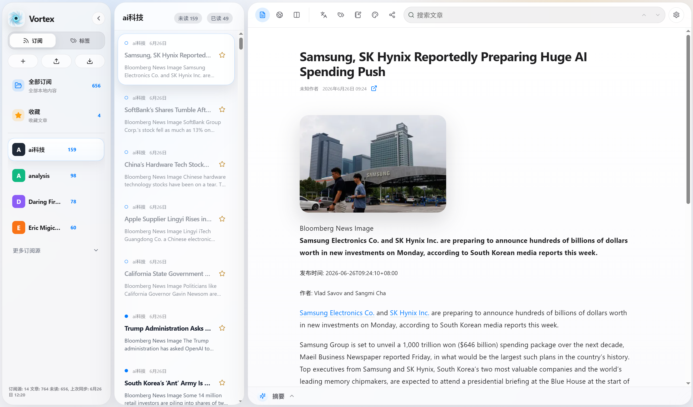
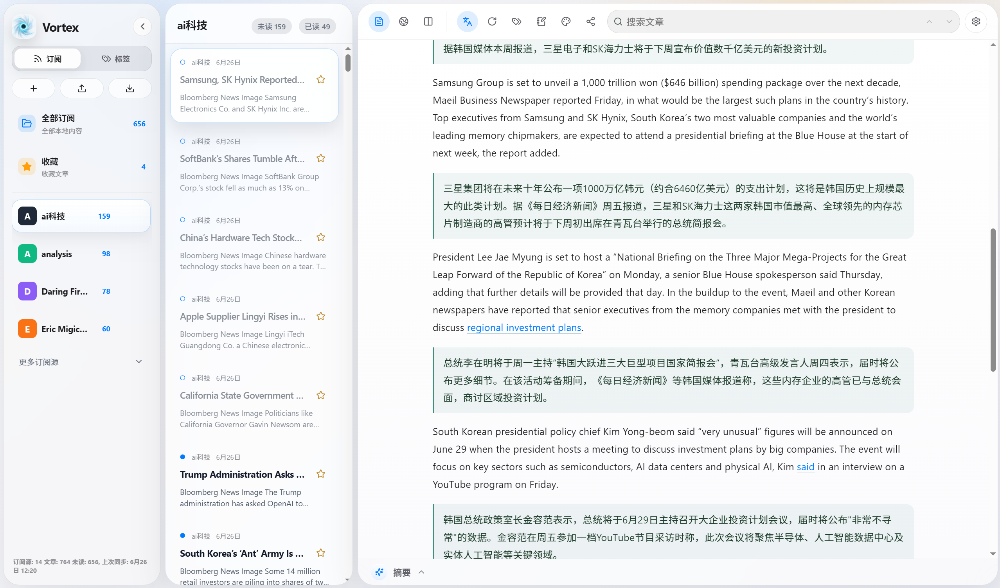
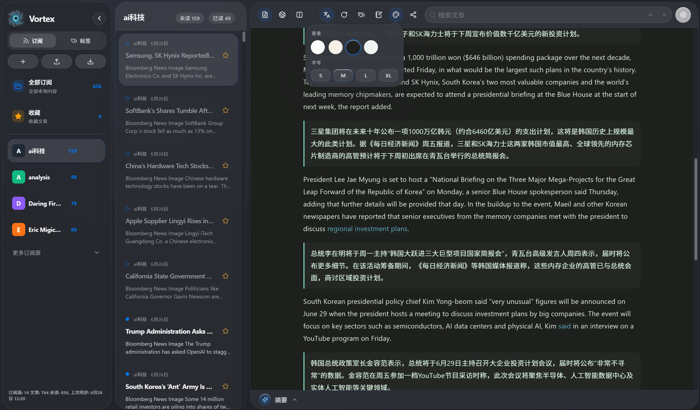
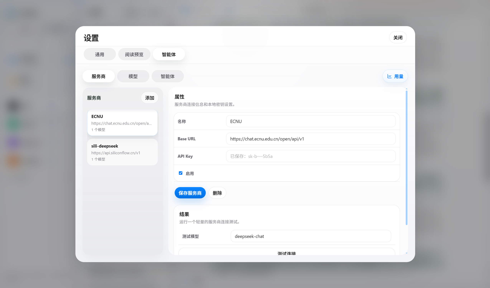
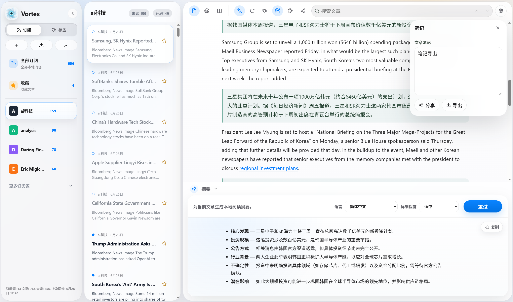
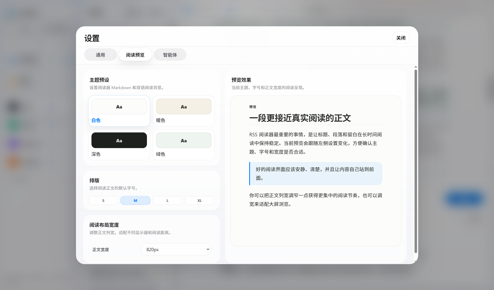

<a id="zh"></a>

# Vortex

[中文](#zh) | [English](#en)

Vortex 是一款本地优先的桌面 RSS 阅读器，用于聚合订阅源、沉浸式阅读文章，并在需要时接入你自己的大语言模型完成摘要、翻译和标签整理。应用数据存储在本机，AI 能力通过用户配置的 OpenAI-compatible API 调用，适合希望把订阅、阅读、摘录和知识整理放在同一工作流里的用户。

### 展示













### 功能特性

- 本地优先：订阅源、文章、阅读状态、标签、笔记、摘要和翻译结果保存在本机 SQLite 数据库中。
- 桌面体验：基于 Tauri 2、Rust 和 React 构建，提供三栏布局、可调整栏宽、隐藏侧边栏、浅色/深色等阅读主题。
- 订阅源管理：支持添加、重命名、删除和同步 RSS/Atom 订阅源，支持 OPML 导入和导出。
- 阅读器：将订阅内容清洗为适合长时间阅读的 Markdown 视图，并支持原网页查看、原文对比、站内链接打开和当前文章查找。
- 阅读状态：支持已读/未读、收藏、按订阅源筛选、全文搜索文章列表。
- 标签系统：支持手动添加标签、AI 标签建议、多标签筛选、标签重命名、合并和删除。
- 笔记与导出：每篇文章可保存 Markdown 笔记，支持分享、复制和导出为 Markdown 文件。
- AI 摘要：为文章生成可配置语言和详细程度的摘要，并保存在本地。
- AI 翻译：支持全文分段翻译、双语对照阅读、选中文本翻译、失败段落重试和重新生成。
- AI 配置：可添加多个 Provider 和 Model，为摘要、翻译、标签三个 Agent 分别指定模型。
- 用量统计：按 Provider、Model、Agent 查看本地 AI 请求数和 token 用量，并可清理过期记录。
- 界面语言：支持简体中文和英文界面切换。

### 系统要求

- Windows：Windows 10/11，x64 架构。
- macOS：Apple Silicon 机型，arm64 架构。
- AI 功能为可选功能；如需使用摘要、翻译或标签建议，需要自行准备一个兼容 OpenAI Chat Completions 的 API 服务，可以是云端服务，也可以是本地模型服务。
- 当前发布包为正式首版，主要用于课程验收、演示和日常使用；macOS 包仍未 notarize，打开方式见下方说明。

### 下载与安装

请从仓库的 [Releases](https://github.com/winnyinthemoo/RSSReader/releases) 页面下载对应平台的安装包。

Windows 正式首版为 [v1.0.0](https://github.com/winnyinthemoo/RSSReader/releases/tag/v1.0.0)。下载 `Vortex_1.0.0_x64-setup.exe`，双击安装即可。

macOS 正式首版为 [v1.0.0](https://github.com/winnyinthemoo/RSSReader/releases/tag/v1.0.0)。下载 `Vortex_1.0.0_aarch64.dmg`，打开后将 `Vortex.app` 拖入“应用程序”。

macOS 版本使用 ad-hoc 签名，尚未 notarize。如果系统提示无法打开或应用已损坏，请先确认已经把 `Vortex.app` 拖入“应用程序”，然后在终端运行：

```bash
xattr -dr com.apple.quarantine /Applications/Vortex.app
```

随后重新打开 Vortex。由于 API Key 存储已经升级为系统钥匙串保存，首次使用 AI 相关功能时，macOS 可能会请求登录钥匙串权限。

### 快速上手

1. 添加订阅源：点击侧边栏的添加按钮，输入 RSS 或 Atom 地址；如果已有订阅列表，可以直接导入 OPML 文件。
2. 同步文章：添加订阅后会拉取文章，也可以在设置里手动同步全部订阅源或当前订阅源。
3. 阅读正文：在中间栏选择文章，右侧会打开清洗后的 Markdown 阅读视图；工具栏可切换原网页、原文对比、主题、字号和正文宽度。
4. 查找与整理：使用文章列表搜索、当前文章查找、已读/未读、收藏、标签筛选来管理阅读队列。
5. 记录笔记：在阅读器侧边面板中为文章添加标签和笔记，笔记可复制、分享或导出为 Markdown 文件。
6. 使用 AI：进入 Settings > Agents，先添加 Provider 和 Model，再为 Summary、Translation、Tagging 指定模型。配置完成后即可生成摘要、双语翻译、选中文本翻译和标签建议。

### 配置 AI 功能

1. 打开 Settings，进入 Agents。
2. 在 Providers 中添加服务商，填写显示名称、Base URL 和 API Key。Base URL 应包含 `/v1` 等服务商要求的前缀，但不要包含 `/chat/completions`。
3. 在 Models 中为该 Provider 添加模型名，例如 `deepseek-chat`、`gpt-4o-mini` 或本地服务暴露的模型名。
4. 在 Agents 中分别为 Summary、Translation、Tagging 选择模型，并设置摘要语言、摘要详细程度、翻译目标语言、翻译并发数和 Prompt 策略。
5. 如果使用本地 Ollama 兼容端点，Base URL 通常为 `http://127.0.0.1:11434/v1`，API Key 可填写任意非空占位值。

### 数据与隐私

- 桌面版会在系统应用数据目录下创建 `vortex.sqlite3`，用于保存订阅源、文章、阅读状态、标签、笔记和 AI 结果。
- API Key 不写入 SQLite，而是保存到操作系统凭据管理器或钥匙串中，服务标识为 `com.rssreader.vortex`。
- Vortex 不需要账号，也不包含独立的远程服务器。订阅源请求直接访问对应网站，AI 请求直接发送给你配置的 Provider。

### 从源码构建

普通用户建议直接下载 Releases 页面中的安装包；以下命令仅面向开发者。

需要 Node.js 20+、Rust stable、Cargo，以及对应平台的 Tauri 2 构建环境。Windows 打包还需要 Visual Studio Build Tools C++ 工具链和 Windows SDK。

```powershell
npm install
scripts\frontend-install.cmd
npm run tauri:dev
npm run tauri:build:windows
```

macOS / Linux：

```bash
npm install
sh scripts/frontend-install.sh
npm run tauri:dev
npm run tauri:build:mac
```

### 项目结构

```text
backend/                 Rust 后端库，负责订阅源、数据库、AI 调用和开发服务器
db/migrations/           SQLite 数据库迁移
frontend/                React + Vite 前端
resources/Agent/Prompts/ 内置 AI Prompt 模板
scripts/                 Windows 与 macOS/Linux 开发脚本
shared/                  前后端共享 TypeScript 契约
src-tauri/               Tauri 桌面应用壳与打包配置
```

### 常见问题

- macOS 提示无法打开或应用已损坏：请确认应用已拖入“应用程序”，然后运行上文的 `xattr` 命令。
- AI Provider 测试失败：检查 Base URL、API Key、模型名和网络连通性，确认服务支持 OpenAI Chat Completions。
- OPML 导入后部分订阅源没有文章：导入流程会跳过重复源，失败源会保留错误信息；可以在应用中重新同步对应订阅源。

### 许可证

本项目采用 MIT License，详见 [LICENSE](LICENSE)。

---

<a id="en"></a>

# Vortex

Vortex is a local-first desktop RSS reader for collecting feeds, reading comfortably, and using your own large language model setup for summaries, translation, and tagging. App data stays on your machine, and AI features call the OpenAI-compatible provider you configure.

### Features

- Local-first storage: feeds, articles, reading state, tags, notes, summaries, and translations are stored in a local SQLite database.
- Desktop app: built with Tauri 2, Rust, and React, with a resizable three-pane layout, collapsible sidebar, and reader themes.
- Feed management: add, rename, delete, and sync RSS/Atom feeds; import and export subscriptions through OPML.
- Reader: cleaned Markdown reading view with original-page view, side-by-side comparison, in-reader link opening, and in-article find.
- Reading workflow: read/unread state, favorites, feed filters, and article-list search.
- Tags: manual tags, AI tag suggestions, multi-tag filters, tag rename, merge, and delete.
- Notes and export: save Markdown notes per article, share or copy them, and export notes as Markdown files.
- AI summaries: generate article summaries with configurable language and detail level.
- AI translation: full-article segmented translation, bilingual reading, selected-text translation, failed-segment retry, and regeneration.
- AI setup: configure multiple Providers and Models, then assign models separately to Summary, Translation, and Tagging agents.
- Usage reports: inspect local AI request and token usage by Provider, Model, and Agent, with cleanup controls.
- Localization: switch the app interface between Simplified Chinese and English.

### Requirements

- Windows: Windows 10/11 on x64.
- macOS: Apple Silicon on arm64.
- AI features are optional. To use summaries, translation, or tag suggestions, bring an OpenAI Chat Completions compatible API, either cloud-hosted or local.
- Current release packages are the 1.0.0 first stable release; the macOS build is still ad-hoc signed and not notarized.

### Download And Install

Download the installer for your platform from the [Releases](https://github.com/winnyinthemoo/RSSReader/releases) page.

The Windows first stable release is [v1.0.0](https://github.com/winnyinthemoo/RSSReader/releases/tag/v1.0.0). Download `Vortex_1.0.0_x64-setup.exe` and run the installer.

The macOS first stable release is [v1.0.0](https://github.com/winnyinthemoo/RSSReader/releases/tag/v1.0.0). Download `Vortex_1.0.0_aarch64.dmg`, open it, and drag `Vortex.app` into Applications.

The macOS build uses ad-hoc signing and is not notarized. If macOS says the app cannot be opened or is damaged, first make sure `Vortex.app` is in Applications, then run:

```bash
xattr -dr com.apple.quarantine /Applications/Vortex.app
```

Open Vortex again after running the command. Because API keys are stored through the system keychain, macOS may ask for keychain access the first time you use AI features.

### Quick Start

1. Add feeds: click the add button in the sidebar and enter an RSS or Atom URL. If you already have subscriptions, import an OPML file.
2. Sync articles: Vortex fetches articles after a feed is added, and you can also manually sync all feeds or the selected feed from Settings.
3. Read: select an article from the middle column and read the cleaned Markdown view on the right. The toolbar switches original page, comparison view, theme, font size, and body width.
4. Find and organize: use article-list search, in-article find, read state, favorites, and tag filters to manage your reading queue.
5. Take notes: add tags and notes from the reader side panel. Notes can be copied, shared, or exported as Markdown.
6. Use AI: open Settings > Agents, add Provider and Model entries, then assign models to Summary, Translation, and Tagging. After that, you can generate summaries, bilingual translations, selected-text translations, and tag suggestions.

### Configure AI

1. Open Settings and go to Agents.
2. Add a Provider with display name, Base URL, and API Key. The Base URL should include any required prefix such as `/v1`, but should not include `/chat/completions`.
3. Add a Model for that Provider, using the model name expected by the service.
4. Assign models to Summary, Translation, and Tagging agents, then configure summary language, detail level, translation target language, translation concurrency, and prompt strategy.
5. For a local Ollama-compatible endpoint, the Base URL is usually `http://127.0.0.1:11434/v1`, and the API Key can be any non-empty placeholder.

### Data And Privacy

- The desktop app creates `vortex.sqlite3` in the system app data directory for feeds, articles, reading state, tags, notes, and AI outputs.
- API keys are not written to SQLite. They are stored in the operating system credential store or keychain under the service identifier `com.rssreader.vortex`.
- Vortex does not require an account and does not include its own remote server. Feed requests go directly to the source sites, and AI requests go directly to the Provider you configure.
- In browser development mode, the frontend talks to the local backend at `http://127.0.0.1:5181`.

### Build From Source

End users should download an installer from Releases. The following commands are for developers.

You need Node.js 20+, Rust stable, Cargo, and the Tauri 2 build prerequisites for your platform. Windows packaging also requires Visual Studio Build Tools with the C++ toolchain and Windows SDK.

```powershell
npm install
scripts\frontend-install.cmd
npm run tauri:dev
npm run tauri:build:windows
```

macOS / Linux:

```bash
npm install
sh scripts/frontend-install.sh
npm run tauri:dev
npm run tauri:build:mac
```

### Project Layout

```text
backend/                 Rust backend library for feeds, database, AI calls, and dev server
db/migrations/           SQLite database migrations
frontend/                React + Vite frontend
resources/Agent/Prompts/ Built-in AI prompt templates
scripts/                 Windows and macOS/Linux development scripts
shared/                  TypeScript contracts shared by frontend and backend
src-tauri/               Tauri desktop shell and packaging config
```

### Troubleshooting

- macOS says the app cannot be opened or is damaged: make sure the app is in Applications, then run the `xattr` command shown above.
- AI Provider test fails: check Base URL, API Key, model name, network access, and OpenAI Chat Completions compatibility.
- OPML import has missing articles: duplicate feeds are skipped and failed feeds keep error details; sync the affected feed again from the app.

### License

This project is licensed under the MIT License. See [LICENSE](LICENSE).
