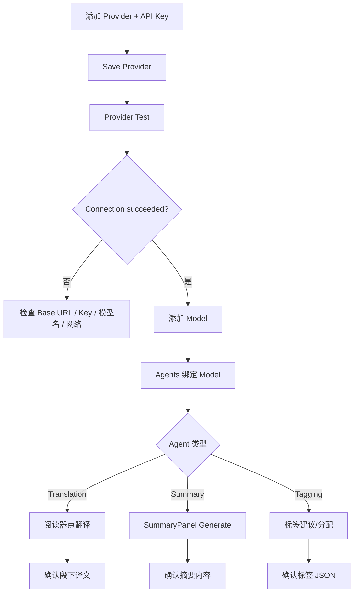

# AI Provider / Model 兼容性与测试清单

> 最后更新：2026-06-12  
> 维护：AI 组；每次在新环境验证 Provider/Model 后，请更新本文「已测试清单」。

本文说明 RSSReader（Vortex）当前 **实际调用** 的 LLM 接口形态、理论上可兼容的范围，以及在 **Windows** 上经简单手工测试通过的 Provider / Model 列表。

相关文档：

- 实现进度：`docs/ai-progress.md`
- 问题记录：`docs/ai-issues.md`
- Mercury 规格对照：`docs/mercury-ai-spec-index.md`
- API Key 存储：`docs/ai-progress.md` →「API Key 存储说明」

---

## 兼容原则

### 接口要求

后端仅通过 `backend/src/ai/client/openai_compat.rs` 调用 **OpenAI Chat Completions 兼容** 接口：

```http
POST {base_url}/chat/completions
Authorization: Bearer {api_key}
Content-Type: application/json
```

请求体（非流式）：

```json
{
  "model": "模型名",
  "messages": [
    { "role": "system", "content": "..." },
    { "role": "user", "content": "..." }
  ],
  "stream": false
}
```

期望响应至少包含：

```json
{
  "choices": [{ "message": { "content": "..." } }],
  "usage": { "prompt_tokens": 0, "completion_tokens": 0 }
}
```

`usage` 字段可选；缺失时用量统计可能为空，但不影响功能。

### Base URL 填写规范

| 规则 | 说明 |
|------|------|
| 带 `/v1` 后缀 | 多数服务商要求，如 `https://api.deepseek.com/v1` |
| 不要重复路径 | 代码会自动拼接 `/chat/completions`，Base URL 不要再加该段 |
| 本地 Ollama | 使用 `http://127.0.0.1:11434/v1`；API Key 可填任意占位（如 `ollama`） |
| 唯一性 | 同一 Base URL 在应用内只能对应一个 Provider（数据库唯一索引） |

### 功能与 Agent 对应关系

| Agent | 用途 | 可调 Prompt 策略 |
|-------|------|------------------|
| **Summary** | 文章摘要 | 标准（`summary.yaml`） |
| **Translation** | 全文按段翻译 | `standard` 或 `hy_mt_optimized`（`translation.hy-mt.yaml`） |
| **Tagging** | 标签建议与分配 | 标准（`tagging.yaml`） |

每个 Agent 在 **AI 设置 → Agents** 中独立绑定 `primary_model`（及可选 `fallback_model`）。

### 目标语言

摘要、翻译、AI 设置共用 **17 种** 目标语言（`frontend/src/constants/targetLanguages.ts`）。界面显示本族语名称；后端将语言代码转为英文全称写入 Prompt。实际翻译/摘要质量取决于模型多语言能力。

---

## Windows 已测试清单

> **测试环境**：Windows 10/11，Tauri 桌面版或 `scripts/dev-all.cmd` 开发模式。  
> **测试方式**：Provider Test（连通性）+ 对应 Agent 的实际调用（摘要 / 翻译 / 打标签）。  
> **测试深度**：简单手工验证（非压力测试、非全语言矩阵）。

### Provider / Model 一览

| Provider 名称 | Base URL | Model | 测试项 | 结果 | 备注 |
|---------------|----------|-------|--------|------|------|
| **ECNU** | `https://chat.ecnu.edu.cn/open/api/v1` | `ecnu-max` | Provider Test；Tagging；Translation；Summary | ✅ 通过 | 校内/私有 OpenAI 兼容网关；需有效 API Key |
| **deepseek** | `https://api.deepseek.com/v1` | `deepseek-v4-flash` | Provider Test；Summary；Translation | ✅ 通过 | 官方 DashScope 兼容模式外的 DeepSeek 直连；模型名以控制台为准 |
| **Qwen** | `https://dashscope.aliyuncs.com/compatible-mode/v1` | `qwen-flash` | Provider Test；Summary；Translation | ✅ 通过 | 阿里云百炼 OpenAI 兼容端点 |
| **chatanywhere_tech（中转站）** | `https://api.chatanywhere.tech/v1` | `gpt-4o-mini` | Provider Test；Summary；Translation | ✅ 通过 | 第三方 OpenAI 兼容中转；模型名随服务商文档填写 |
| **Hy-MT2 Local** | `http://127.0.0.1:11434/v1` | `kaelri/hy-mt2:1.8b` | Provider Test；Translation | ✅ 通过 | 本地 Ollama；Translation 使用 **HY-MT optimized** 策略 |

### 当前 Agent 绑定示例（本机配置）

以下为开发机上已验证可用的绑定组合，**非强制默认值**，新用户需自行配置 Provider、Model 与 Agent：

| Agent | Provider | Model | 附加设置 |
|-------|----------|-------|----------|
| Translation | Hy-MT2 Local | `kaelri/hy-mt2:1.8b` | `promptStrategy`: `hy_mt_optimized` |
| Summary | chatanywhere_tech | `gpt-4o-mini` | `defaultDetailLevel`: `medium` |
| Tagging | ECNU | `ecnu-max` | — |

---

## 推荐配置示例

### 云端通用模型（摘要 / 打标签）

1. AI 设置 → **Providers** → 添加 Provider（名称、Base URL、API Key）→ **Save** → **Test**。
2. **Models** → 为该 Provider 添加 `model_name`（与服务商文档一致）。
3. **Agents** → Summary 或 Tagging → 选择对应 Model → Save。

### 本地 Hy-MT2 翻译（Ollama）

**1. 安装并拉取模型**

```powershell
ollama pull kaelri/hy-mt2:1.8b
```

**2. 命令行快速验证**

```powershell
curl http://127.0.0.1:11434/v1/chat/completions `
  -H "Content-Type: application/json" `
  -H "Authorization: Bearer ollama" `
  -d '{"model":"kaelri/hy-mt2:1.8b","messages":[{"role":"user","content":"把下面翻译成简体中文：Hello world"}],"stream":false}'
```

**3. Vortex 内配置**

| 字段 | 值 |
|------|-----|
| Provider 名称 | Hy-MT2 Local |
| Base URL | `http://127.0.0.1:11434/v1` |
| API Key | `ollama`（或任意非空占位） |
| Model | `kaelri/hy-mt2:1.8b` |
| Translation Agent → Prompt | **HY-MT optimized** |

**4. 联调**：阅读器打开文章 → 点翻译 → 等待段级译文出现在原文下方。

> 更大模型：`ollama pull kaelri/hy-mt2:7b-q4_K_M`（需更多内存/显存）。  
> 模型页：https://ollama.com/kaelri/hy-mt2

---

## 理论兼容、尚未列入已测清单

以下类型在 **接口形态正确** 的前提下通常可用，但本项目 **尚未** 在 CI 或文档中正式验收：

| 类型 | 示例 | 条件 |
|------|------|------|
| OpenAI 官方 | `https://api.openai.com/v1` | 有效 API Key；模型名如 `gpt-4o-mini` |
| 其他国内兼容网关 | Moonshot、智谱、百川等 | 提供 `/v1/chat/completions` |
| 本地推理 | LM Studio、vLLM、LocalAI | 暴露 OpenAI 兼容 HTTP 端点 |
| Azure OpenAI | — | 需独立适配；**当前未支持** deployment 路径与 Azure 鉴权头 |

若你验证通过，请按下方「如何贡献测试记录」追加一行。

---

## 已知限制与注意事项

| 项目 | 说明 |
|------|------|
| **仅 Chat Completions** | 不支持 Embeddings、Images、Audio、Assistants、Batch 等其它 OpenAI API |
| **非流式** | 请求固定 `stream: false`；UI 无 SSE 增量输出（摘要流式见 AI-07 待办） |
| **HTTP 超时** | 单次 LLM 请求约 **20 秒**（`openai_compat.rs`）；长文翻译/本地慢模型可能超时 |
| **无自动重试** | LLM 失败需用户手动 **Try again**（摘要按钮 / 翻译 ↻） |
| **API Key** | 存 OS 凭据管理器（`com.rssreader.vortex`），不入 SQLite；保存后界面不回显 |
| **开发模式安全** | 浏览器开发时 `/api/ai/*` 无本地鉴权，见 `ai-issues.md` |
| **Hy-MT2** | 无专用 SDK；依赖 OpenAI 兼容层 + `hy_mt_optimized` Prompt，非腾讯官方插件 |

---

## 如何验证（标准手工流程）



**最低验收标准**

1. Provider Test 返回 `Connection succeeded`。
2. 对应 Agent 能完成一次端到端调用且无 `API key not configured` / HTTP 4xx/5xx 报错。
3. 翻译：至少一段正文下方出现可读译文；摘要：面板有非空文本。

---

## 如何贡献测试记录

在「Windows 已测试清单」表中追加一行，建议包含：

- 测试日期与 OS 版本
- Provider 显示名、Base URL、Model 名
- 验证的 Agent（Summary / Translation / Tagging）或仅 Provider Test
- 结果（✅ / ⚠️ 部分通过 / ❌）
- 简短备注（超时、特定语言、Prompt 策略等）

同时在 `docs/ai-progress.md` 文末追加一条进度记录（可选）。

---

## 附录：代码入口

| 路径 | 作用 |
|------|------|
| `backend/src/ai/client/openai_compat.rs` | OpenAI 兼容 HTTP 客户端 |
| `backend/src/ai/secrets.rs` | API Key（keyring） |
| `backend/src/ai/provider/service.rs` | Provider CRUD + Test |
| `resources/Agent/Prompts/*.yaml` | 内置 Prompt 模板 |
| `frontend/src/features/ai/components/AiSettingsPage.tsx` | AI 设置 UI |
| `frontend/src/constants/targetLanguages.ts` | 17 种目标语言 |
